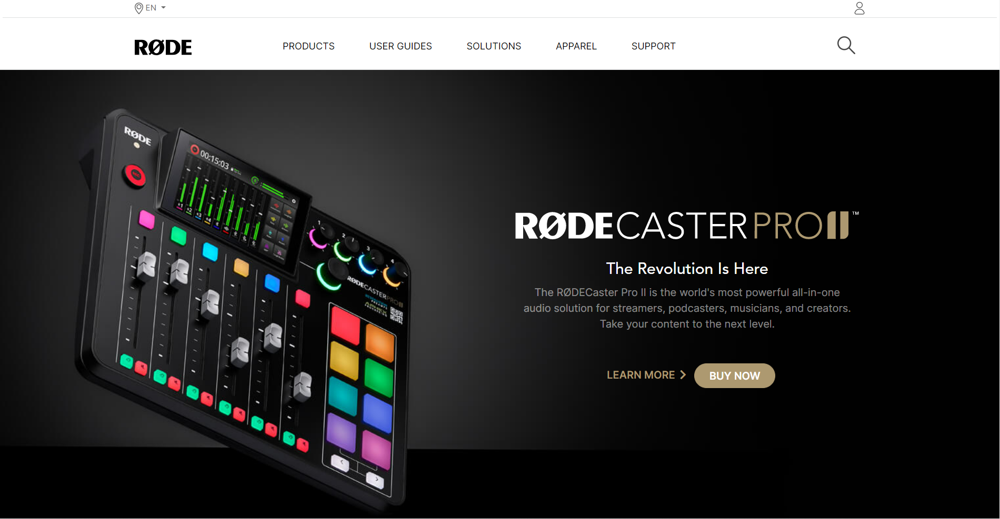

# RODE Website Clone Project.

## **Project: RODE Website UI Clone Project using Tailwind CSS.**

### Concepts learned from this project:
- Learned more about image responsiveness and more about relative,absolute and fixed position in Tailwind CSS.
- Learned about adding brightness,contrast,hover effects and hiding certain block at certain breakpoint.   
- The Entire project is builded using pure Tailwind CSS.

### Time taken to complete this project:
- It took more than 1 day to complete.
- Adding HTML Part took 3 hour.
- Tailwind css part and Responsive Design part took more than 6-8 hour.

**Live Link :** [Click Here](https://rode-website.netlify.app/ "Deployed on Netlify")

>### Preview :

